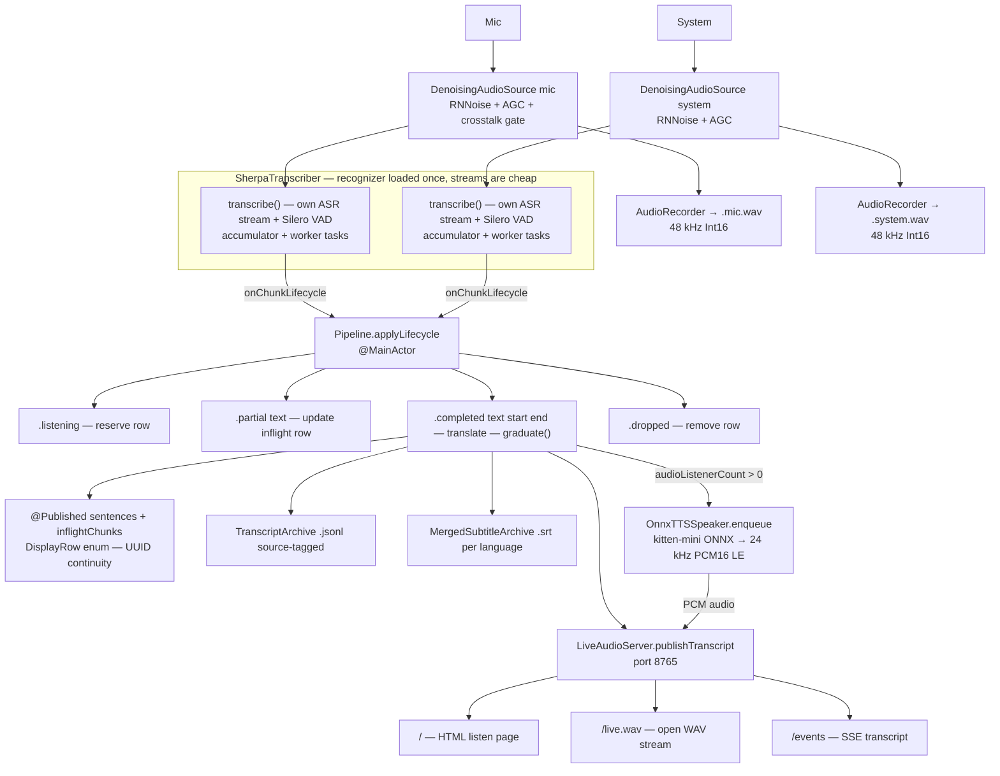
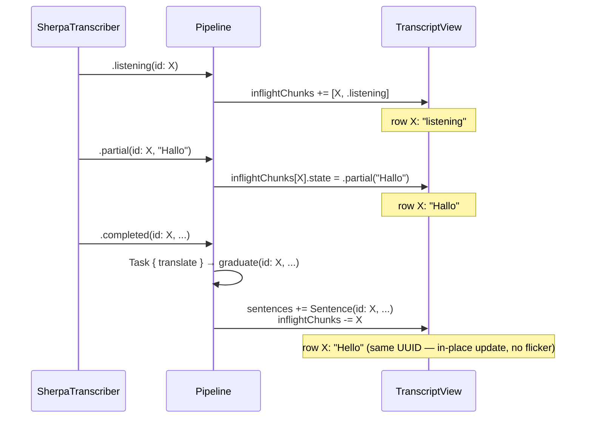

# LiveTranslate — context for Claude (feature/onnx-streaming)

> Also published as the `main` branch of `github.com/mtib/live-translate-de-en-onnx`.
> This is a **completely different codebase** from the `main` branch of this same
> repo (`transcrybe-diy`), which uses whisper.cpp + Apple Speech. This branch uses
> sherpa-onnx streaming RNN-T and has no whisper, no AVSpeechSynthesizer, and no
> runtime language pickers.

---

## Rule 1: Update this file in the same commit as any meaningful code change

"Meaningful change" means: any change to data flow, type shapes, lifecycle state machine, sentence-splitting logic, file layout, build steps, permissions, model paths, or key behaviors documented in this file.

This file is read by AI agents at the **start** of every session. Stale content causes agents to edit against a model that doesn't match the actual code — leading to incorrect diffs, missed invariants, and re-introduction of fixed bugs. The source comments say *what* a function does; CLAUDE.md says *why the design is shaped this way* and *what not to do again*.

## Rule 2: Persist learnings

Every time a bug bites — a race, an actor-isolation surprise, a confused-by-the-API moment, a sherpa-onnx misuse — add a numbered entry to "Things that have bitten us already." Include: what went wrong, why it was hard to diagnose, and the shape of the fix. Do not remove old entries. The list is institutional memory.

## Rule 3: Eagerly load Swift sources at session start

Before editing any code, read **all** of `Sources/LiveTranslate/*.swift`. The data flow crosses many files and the interactions at the boundaries are subtle. In particular:

- Lifecycle events flow from `SherpaTranscriber.onChunkLifecycle` → `Pipeline.applyLifecycle`
- UUID continuity is a shared contract between `SherpaTranscriber`, `Pipeline`, and `TranscriptView` — breaking it in any one place causes UI flicker
- The crosstalk gate is applied in `DenoisingAudioSource` (after RNNoise, before the broadcaster) so both recorder AND transcriber see the same muted buffer

Skimming or grepping for one symbol misses these patterns. Read everything, then edit.

## Rule 4: Always build with the signing identity

```sh
LIVETRANSLATE_SIGN_IDENTITY=LiveTranslateDev ./build.sh
```

The user keeps `export LIVETRANSLATE_SIGN_IDENTITY=LiveTranslateDev` in `~/.zshrc`. Non-interactive bash (the agent's Bash tool) does NOT source `.zshrc`. Without the variable every build is ad-hoc-signed, which produces a fresh `cdhash` and causes macOS TCC to re-prompt for mic + screen recording permission on every launch. Always set the env var explicitly in any build command the agent runs.

---

## How it's built

### SwiftPM, no Xcode

- No `.xcodeproj`. Pure SwiftPM. `swift-tools-version: 6.0`.
- The `LiveTranslate` executable target is pinned to `.swiftLanguageMode(.v5)` —
  the Apple Translation APIs are awkward under Swift 6 strict concurrency (in
  particular the `AsyncStream<Never>` parking trick in `.translationTask` and the
  `@MainActor`-load-bearing translation dispatch).
- macOS deployment target: `.macOS(.v26)` — bumped from v15 to enable the `FoundationModels` framework (Apple Intelligence on-device LLM). Requires swift-tools-version 6.2.
- **No CMake.** sherpa-onnx comes as pre-built dylibs — the `CSherpaOnnx` bridge
  target links against `external/sherpa-onnx/lib/` at build time.

### tools/download-sherpa.sh

Idempotent — skips anything already present. Downloads:

| Artifact | Source | Destination |
|---|---|---|
| `libsherpa-onnx-c-api.dylib` + `libonnxruntime.1.24.4.dylib` | `sherpa-onnx-v1.13.2-osx-arm64-shared.tar.bz2` from `k2-fsa/sherpa-onnx` v1.13.2 | `external/sherpa-onnx/lib/` |
| `silero_vad.onnx` | `asr-models/silero_vad.onnx` from sherpa-onnx releases | `build/sherpa-models/` |
| `sherpa-onnx-streaming-zipformer-de-kroko-2025-08-06/` | `asr-models/<name>.tar.bz2` | `build/sherpa-models/<dir>/` |
| `kitten-mini-en-v0_8/` | `tts-models/kitten-mini-en-v0_8.tar.bz2` | `build/sherpa-models/<dir>/` |

The kitten-mini directory contains: `model.onnx`, `voices.bin`, `tokens.txt`, and
`espeak-ng-data/`. **There is no `lexicon.txt`** — do not add one to
`OnnxTTSSpeaker`'s model config (see "Things that have bitten us" #25).

### build.sh — step by step

1. `./tools/download-sherpa.sh` — fetches dylibs + models (idempotent).
2. `LIBRARY_PATH=external/sherpa-onnx/lib swift build -c release` — builds the
   Swift executable, linking `libsherpa-onnx-c-api` and `libonnxruntime`.
3. `rm -rf build/LiveTranslate.app && mkdir -p .../MacOS .../Resources .../Frameworks`
4. Copy binary → `Contents/MacOS/LiveTranslate`.
5. Copy `Info.plist` → `Contents/Info.plist`.
6. `install_name_tool -add_rpath @executable_path/../Frameworks` on the binary.
7. Copy `libsherpa-onnx-c-api.dylib` and `libonnxruntime.1.24.4.dylib` into
   `Contents/Frameworks/`. Create unversioned symlink `libonnxruntime.dylib`.
8. Copy `silero_vad.onnx` → `Contents/Resources/`.
9. Copy `sherpa-onnx-streaming-zipformer-de-kroko-2025-08-06/` dir →
   `Contents/Resources/`.
10. Copy `kitten-mini-en-v0_8/` dir → `Contents/Resources/`.
11. `./tools/make-icon.sh build/icon` + copy `icon.icns` → `Contents/Resources/`.
12. `codesign --force --deep --sign "${SIGN_IDENTITY}"` where `SIGN_IDENTITY`
    defaults to `-` (ad-hoc) if `LIVETRANSLATE_SIGN_IDENTITY` is unset.
13. Print `✓ built build/LiveTranslate.app`.

### ModelConfig.swift — compile-time language pair

```swift
enum ModelConfig {
    static let sourceLanguage = "de"         // BCP-47 source
    static let targetLanguage = "en"         // BCP-47 target
    static let provider = "coreml"           // ONNX EP; falls back to "cpu"

    static let asrModelDir = "sherpa-onnx-streaming-zipformer-de-kroko-2025-08-06"
    static var asrEncoder: String { "\(asrModelDir)/encoder.onnx" }
    static var asrDecoder: String { "\(asrModelDir)/decoder.onnx" }
    static var asrJoiner:  String { "\(asrModelDir)/joiner.onnx" }
    static var asrTokens:  String { "\(asrModelDir)/tokens.txt" }

    static let vadModel = "silero_vad.onnx"

    static let ttsModelDir = "kitten-mini-en-v0_8"
    static var ttsModel:   String { "\(ttsModelDir)/model.onnx" }
    static var ttsVoices:  String { "\(ttsModelDir)/voices.bin" }
    static var ttsTokens:  String { "\(ttsModelDir)/tokens.txt" }
    static var ttsDataDir: String { "\(ttsModelDir)/espeak-ng-data" }
}
```

To retarget: change `sourceLanguage`, `targetLanguage`, swap out the ASR model dir,
and rebuild. No runtime picker exists — what's compiled is what runs.

### Always launch via `open`

```sh
open build/LiveTranslate.app
```

Never run the binary directly. TCC associates permission grants with the bundle ID,
not the executable path. Direct exec makes macOS think the usage-description keys are
missing and the app crashes on its first permission request.

---

## Architecture



---

## Key design decisions

- **Per-stream pipelines — no shared locks, parallel execution.** Mic and system each
  go through their own `DenoisingAudioSource` (independent RNNoise state, AGC), their
  own `AudioRecorder`, and their own `SherpaTranscriber.transcribe()` call. Each
  `transcribe()` creates a fresh sherpa-onnx ASR stream and Silero VAD instance on
  the shared recognizer (recognizer is loaded once; creating a new `OnnlineStream` on
  it is cheap). Mic and system accumulate, decode, and fire lifecycle events
  concurrently — no lock required at the stream level.

- **Inflight-chunk UI model with UUID continuity.** At voice onset the accumulator
  fires `.listening` with a new `UUID`. That UUID travels with the chunk through
  `.partial`, `.translating`, and finally `.completed`, at which point `Pipeline`
  builds a `Sentence` with the **same UUID** and inserts it into `sentences` while
  removing the `InflightChunk` from `inflightChunks`. `TranscriptView.displayRows`
  builds a single merged array (`sentences + inflightChunks`) keyed by UUID. SwiftUI
  sees an in-place content update on the same row — no remove+insert, no flicker.
  The `DisplayRow` enum (`case sentence(Sentence)` / `case inflight(InflightChunk)`)
  is what makes this work: both cases expose the same `id: UUID`.

- **`onChunkLifecycle` callback, not snapshot stream.** `SherpaTranscriber` exposes
  `var onChunkLifecycle: (@Sendable (UUID, SourceTag, ChunkLifecycle) -> Void)?`.
  The accumulator + worker call it from background tasks; `Pipeline.handleChunkLifecycle`
  (which is `nonisolated`) hops to `@MainActor` via `Task { @MainActor in }` and
  drives the state machine in `applyLifecycle`. The `AsyncThrowingStream<SessionSnapshot>`
  returned by `transcribe()` is drained but its values are ignored — lifecycle
  callbacks are the single source of truth. This is what lets partial translations
  and final translations fit cleanly into the same state machine without a separate
  translation worker task.

- **`ChunkLifecycle` states.** Four cases:
  - `.listening` — voice onset; row reserved with "listening" placeholder
  - `.partial(text: String)` — streaming ASR produced new tokens; fires on every
    hypothesis change; UI shows the *active* portion (everything after the last
    force-complete boundary in this turn)
  - `.completed(text: String, startSeconds: Double?, endSeconds: Double?)` — endpoint
    fired or force-complete triggered; text is the final committed hypothesis for this
    chunk; timestamps are seconds from audio-stream start (16 kHz sample counts)
  - `.dropped` — chunk had no voice, empty text, or punctuation-only content; row
    collapses

- **`InflightChunk.State` (distinct from `ChunkLifecycle`).** Three cases in
  `Types.swift`:
  - `.listening` — matching the lifecycle event
  - `.partial(text: String, translation: String?)` — text grows with ASR; translation
    field populated after the 1 s throttle fires
  - `.translating(text: String)` — endpoint closed, final translation dispatched, no
    prior partial translation to show

  Note: there is **NO `.transcribing` state** — the old whisper.cpp design had that
  but sherpa-onnx streams tokens live, so we jump straight to `.partial`.

- **Partial translations — 1 s throttle.** In `applyLifecycle(.partial(text:))`:
  if `partialTranslationTimers[id]` is less than 1 s ago, skip the dispatch. Otherwise
  stamp the timer and fire `Task { @MainActor in translator.translate(text) }`. Only
  apply the result if the chunk's current `partial` text still matches the text that
  was sent — avoids stale partial translations overwriting a newer hypothesis.

- **Sentence splitting — three mechanisms:**
  1. **Force-complete at `maxCharsPerRow` (30 chars) + boundary.** When the active
     portion of the hypothesis exceeds 30 characters and `sentenceBoundary(in:)` finds
     a `. ` (after a letter — skips decimals), `? `, or `! ` pattern, the accumulator
     immediately fires `.completed` for the text up to and including the punctuation,
     increments `committedLength`, and opens a new chunk for the remainder. This keeps
     rows from growing too long and starts translation/TTS promptly.
  2. **Endpoint at `endpointSilenceSeconds` (1.8 s) trailing silence.** Sherpa-onnx
     rule-1 fires. If the hypothesis has a terminal punctuation character and/or the
     trailing silence exceeds `rule2SilenceSeconds` (2.4 s) or the utterance exceeds
     `maxUtteranceSeconds` (60 s), the accumulated text (minus already-committed
     portions) is sent to the worker. **Semantic suppression:** if the hypothesis has
     no terminal punctuation AND trailing silence < 2.4 s AND utterance < 59 s, the
     endpoint is ignored — German speakers take long breaths mid-sentence.
  3. **Stream end (Stop pressed).** Any in-flight turn gets `InputFinished` + a final
     decode cycle, then emits as a completed chunk.

- **`normalizeHypothesis(_:)`.** The German zipformer model sometimes prepends
  `. ` / `? ` / `! ` to the first hypothesis after a stream reset (indicating the
  prior sentence ended). `normalizeHypothesis` strips any leading `.?! ` characters
  to prevent the row from starting with punctuation. Applied to every hypothesis read
  from `SherpaOnnxGetOnlineStreamResult`.

- **`chunkStartSample` / `lastVoicedEndSample` — timestamp accuracy.** The accumulator
  tracks two sample-level positions:
  - `chunkStartSample` — 16 kHz sample index at voice onset of the current chunk.
    Updated on force-complete (next chunk starts at `cumulativeSamples`).
  - `lastVoicedEndSample` — 16 kHz sample index at the last voiced→silent transition
    (`prevVoiced == true && voiced == false`). Used as the chunk's `endSample` so the
    SRT cue ends at the last voiced sample, not at the end of the trailing silence
    buffer. This makes SRT cues line up closely with audible speech.
  The worker converts these to seconds as `Double(sample) / 16_000`. Pipeline anchors
  them to `runStartedAt` to produce wall-clock `createdAt` / `endsAt` in the
  `Sentence`. The recorder subscribes to the same broadcaster, so audio-stream sample
  positions = positions in the `.wav`.

- **Audio format invariant.** Both sources standardise on **48 kHz mono Float32**
  (RNNoise's native rate). `MicrophoneSource` converts from the hardware's native
  format via `AVAudioConverter`; `SystemAudioSource` does the same from SCK's
  48 kHz stereo. `DenoisingAudioSource` applies RNNoise at 48 kHz. The accumulator
  in `SherpaTranscriber` resamples 48 → 16 kHz internally (a per-stream
  `SherpaResampler` using `AVAudioConverter`). The `AudioRecorder` writes 48 kHz
  Float32 buffers to disk using an `AVAudioFile` configured for 48 kHz Int16 PCM
  (AVFoundation auto-converts on the write path).

  **The `.wav` is 48 kHz mono Int16**, not 16 kHz — the `AudioRecorder` is written
  at 48 kHz (see its `AVAudioFile` settings). The comment in the old CLAUDE.md
  saying "16 kHz" was wrong.

- **RNNoise per stream.** Vendored xiph/rnnoise v0.1.1 (BSD 3-clause, GRU weights in
  `rnn_data.c`, ~400 KB static). Each `DenoisingAudioSource` has its own
  `RNNoiseProcessor`. Wants ±32768-scaled Float32 in 480-sample frames at 48 kHz
  (10 ms latency). `RNNoiseProcessor` buffers arbitrary input sizes and handles the
  scale conversion.

- **AGC.** `DenoisingAudioSource` runs an envelope-follower AGC after RNNoise, before
  the crosstalk gate. Measures RMS via `vDSP_measqv`, EMAs the level over voiced
  buffers (`agcNoiseFloor = 0.003`), targets `agcTargetRMS = 0.1`, smooths the
  applied gain to avoid pumping (`agcGainSmoothing = 0.06`), multiplies via
  `vDSP_vsmul`. Caps at 8× boost (`agcMaxGain`); never attenuates (`agcMinGain = 1`).

- **Crosstalk suppression.** `SherpaTranscriber` has `markSystemVoiced()` and
  `isSystemRecentlyVoiced()` (protected by `crosstalkLock: NSLock`). In the system
  accumulator: when buffer RMS ≥ `silenceRMSThreshold` (0.012), call
  `markSystemVoiced()`. In the mic accumulator: if `isSystemRecentlyVoiced()` returns
  true (i.e. system was voiced within `crosstalkPersistSeconds = 0.25 s`), replace
  the 16 kHz effective samples with zeros before feeding the ASR. Additionally,
  `Pipeline.run()` wires `muteWhen: { sherpa?.isSystemRecentlyVoiced() }` on the
  `DenoisingAudioSource(mic)` so the **crosstalk gate is also applied upstream** at
  the broadcaster level — both the recorder and the transcriber see muted audio during
  system playback, not just the recognizer.

- **Translation — `@MainActor` load-bearing.** When `.completed` fires in
  `applyLifecycle`, if src != tgt and no cache hit, Pipeline flips the chunk to
  `.translating` (or keeps the existing partial translation visible) and fires
  `Task { @MainActor [weak self] in translator.translate(text) }`. The explicit
  `@MainActor` on the Task closure is required — without it, Swift 5's
  actor-inheritance heuristics sometimes let the post-`await` `graduate()` call run
  off-actor, causing `@Published` mutations that don't surface in the UI.

- **Translation cache.** `Pipeline.translationCache: [String: String]`, capped at
  200 entries. On overflow, ~10% of oldest entries (by insertion order) are dropped.
  Same-session identical strings reuse the cached translation.

- **`ttsActive` / `ttsListenerCount` / `ttsModelLoaded`.** Three signals:
  - `ttsListenerCount: Int` — updated by `LiveAudioServer.onAudioListenerCountChanged`
    callback, hopped to `@MainActor`.
  - `ttsModelLoaded: Bool` — set by `OnnxTTSSpeaker.onModelLoaded` callback, hopped
    to `@MainActor`, when the kitten-mini model finishes its lazy load on first
    `enqueue()`.
  - `ttsActive: Bool` — computed as `ttsModelLoaded && ttsListenerCount > 0` by
    `recomputeTTSActive()`. Drives the green stream icon in the UI.
  TTS synthesis is gated in `graduate()`: translation is enqueued only if
  `liveAudioServer?.audioListenerCount > 0`. This keeps the model entirely unloaded
  for runs where nobody ever connects to `/live.wav`.

- **Live stream URL.** `LiveAudioServer.streamURL(port:)` prefers the first
  private-range IPv4 from `getifaddrs` (skipping `utun`/`ipsec`/`tun` VPN
  interfaces), falls back to `scutil --get LocalHostName` + `.local`, then to
  `localhost`. The UI shows this in a `StreamShareView` popover with a QR code
  generated via CoreImage's `CIQRCodeGenerator`.

- **Pruning.** Prune loop runs once per second in a background task. Drops sentences
  older than `maxAgeSeconds` (300 s) that aren't the last sentence (protected so the
  UI is never empty mid-stream). Hard cap at `maxSentenceCount` (50) enforced on every
  `graduate()`.

- **Per-run output — temp dir then zip.** Work dir at
  `NSTemporaryDirectory()/livetranslate-<stamp>/`. Zipped to
  `~/Documents/LiveTranslate/<stamp>.zip` using `/usr/bin/zip -j -q -X`.
  The zip contains only `shippedFiles`: the `.jsonl` transcript and (if ffmpeg is
  installed) the `.mkv`. The `.wav` files and intermediate SRTs are **not** shipped
  in the zip — they are intermediates consumed by ffmpeg and then discarded.
  `CrashRecovery` on next launch re-runs the MKV + zip for any leftover work dirs.

- **Compile-time language pair.** `Pipeline.source` and `Pipeline.target` are `let`
  constants derived from `ModelConfig.sourceLanguage` / `ModelConfig.targetLanguage`.
  There are no `@Published var source / target`, no `UserDefaults` save/load for
  language, no source/target pickers in the UI. `TranscriptView` shows a static
  `"\(ModelConfig.sourceLanguage) → \(ModelConfig.targetLanguage)"` label.
  The `translationConfig` in `TranscriptView` reads `pipeline.source.identifier` and
  `pipeline.target.code` — these are stable for the life of the app.

---

## Files table

| File | Role |
|---|---|
| `App.swift` | `@main` entry. Configures `NSWindow`: level `.statusBar` (above full-screen app content), translucent, movable from anywhere, `canJoinAllSpaces`, traffic lights hidden, `fullSizeContentView`. Adds a `MenuBarExtra` status-bar icon (filled when recording) with Show/Hide overlay, Start/Stop, and Quit items. Captures `mainWindow` via `WindowAccessor` for the Show/Hide action. Installs `NSApplication.willTerminateNotification` hook to flush pending sentences on Cmd+Q. Runs `CrashRecovery.recoverPendingSessions()` detached at launch. |
| `TranscriptView.swift` | The whole UI. No language pickers — compile-time constant. Shows `"\(ModelConfig.sourceLanguage) → \(ModelConfig.targetLanguage)"` label. Hosts `.translationTask` (the only way to get a `TranslationSession`), parks the closure via `AsyncStream<Never>` to hold the session alive. `displayRows` merges `sentences + inflightChunks` into `[DisplayRow]` keyed by UUID for flicker-free graduation. `TranscriptRow` handles all `DisplayRow` states. `StreamShareView` popover shows URL + QR code. |
| `TopicSummarizer.swift` | `actor` using Apple FoundationModels. Creates a fresh `LanguageModelSession` per 60-second cycle (no stale conversation history). `isAvailable()` checks `SystemLanguageModel.default.availability` before starting. Free-text generation (not `@Generable` — the macro plugin is not available in CLI builds); parses `Topic:` and `Summary:` lines from output. |
| `Pipeline.swift` | `@MainActor ObservableObject` orchestrator. Owns `sentences`, `inflightChunks`, `translationCache`, `partialTranslationTimers`, `ttsSpeaker`, `liveAudioServer`, `ttsActive`, `ttsListenerCount`, `ttsModelLoaded`. Wires `onChunkLifecycle` in `init`. No persisted settings (language is compile-time). No source/target pickers. `applyLifecycle` is the state machine for all chunk events. |
| `SourcePipeline.swift` | Per-stream pipeline. Owns `AudioRecorder`. Runs `runRecordingLoop` + `runRecognitionCycle` as concurrent async-let children. The `SessionSnapshot` stream from `transcribe()` is drained but ignored — lifecycle callbacks drive everything. |
| `Types.swift` | `SourceLocale`, `TargetLanguage`, `SourceTag` (`.mic` / `.system`, with `iconSystemName` and `shortLabel`), `InflightChunk` (with `.listening`, `.partial(text:translation:)`, `.translating(text:)` — NO `.transcribing`), `Sentence`, `PipelineStatus`, `SessionSentence`, `SessionSnapshot`. Protocols: `AudioSource`, `Transcriber`, `Translator`. |
| `ModelConfig.swift` | Compile-time constants: `sourceLanguage = "de"`, `targetLanguage = "en"`, `provider = "coreml"`, ASR model dir + file paths, VAD model path, TTS model dir + file paths. |
| `SherpaTranscriber.swift` | The transcriber. Loads sherpa-onnx `OnlineRecognizer` once (`ensureRecognizerLoaded`, `NSLock`-protected). Each `transcribe()` call runs `runChunkLoop`: two structured child tasks (accumulator + worker). Accumulator: resamples 48→16 kHz (`SherpaResampler`), feeds Silero VAD + ASR recognizer, tracks `chunkStartSample`/`lastVoicedEndSample`/`committedLength`, fires lifecycle events. Worker: drains `TurnRecord` queue, drops empty/punctuation-only turns, fires `.completed`. `normalizeHypothesis` strips leading `.?! `. `sentenceBoundary` detects `. `(after letter) / `? ` / `! `. Endpoint silence: 1.8 s (rule-1), 2.4 s (rule-2), 60 s hard cap (rule-3). |
| `OnnxTTSSpeaker.swift` | Synthesizes translated text via kitten-mini ONNX TTS (sherpa-onnx `SherpaOnnxOfflineTtsGenerateWithConfig`). Lazy model load on first `enqueue()`. Serial `DispatchQueue`. Batches all pending sentences into one synthesis call (up to `maxQueue = 5`). Drops oldest past cap. Converts Float32 → 24 kHz PCM16 LE via `AVAudioConverter`. Voice `sid = 2` (expr-voice-3-m). `isAvailable()` checks for `ModelConfig.ttsModel` in bundle. |
| `LiveAudioServer.swift` | Hand-rolled HTTP/1.1 server on `NWListener` (port 8765). Routes: `/` → HTML listen page, `/live.wav` → open-ended WAV stream (24 kHz mono PCM16 LE, `0xFFFFFFFF` data size), `/events` → SSE transcript stream, others → 404. Heartbeat: 200 ms tick — pushes 50 ms of silence (2400 bytes) if idle >100 ms and speaker not active; every 25 ticks sends `: ping` SSE comment on event subscribers. `publishTranscript(jsonLine:)` sends JSONL line to SSE subscribers and buffers for replay (capped at 200). `audioListenerCount` drives TTS gating. `streamURL` prefers private IPv4 over `.local` over `localhost`. |
| `TranscriptArchive.swift` | Per-run JSONL archive. One JSON object per line, keys sorted: `end`, `source`, `start`, `transcription`, `translation`. ISO-8601 timestamps with fractional seconds. `static func encodeLine(_:) -> String?` is also used by `LiveAudioServer.publishTranscript` so SSE and disk have identical payloads. Async writes via serial `DispatchQueue`. |
| `MergedSubtitleArchive.swift` | Live-updated SRT merging cues from both sources for one language. No source-prefix in cue text (just the translated/source text). On each `add(...)` call: append cue, sort by start time, rewrite file atomically. Two instances per session (one per distinct language, or one if src == tgt). |
| `SubtitleArchive.swift` | Append-only per-`(source, language)` SRT. (Note: the current `Pipeline.run()` creates `MergedSubtitleArchive` but does **not** create `SubtitleArchive` instances — per-source SRTs are not currently written this branch. `SubtitleArchive` is retained for potential future use.) |
| `BufferBroadcaster.swift` | Fan-out helper. `var stream: AsyncStream<AVAudioPCMBuffer>` returns a fresh stream per access (critical — see "Things that have bitten us" #6 / #11). `emit(_:)` snapshots continuations under `NSLock`, yields outside it. `finishAll()` closes all subscribers — this is what drives graceful pipeline drain on Stop. |
| `MicrophoneSource.swift` | `AVAudioEngine` mic capture. Converts hardware-native format → 48 kHz mono Float32 via `AVAudioConverter`. Permanent tap (installed once on first `start()`). `stop()` removes tap, stops engine, calls `broadcaster.finishAll()`. |
| `SystemAudioSource.swift` | `ScreenCaptureKit` system audio capture. Audio-only (minimal 2×2 video config required by SCK). 48 kHz stereo → 48 kHz mono Float32 via `AVAudioConverter`. Rebuilds converter lazily if source format changes. Uses `CMSampleBufferCopyPCMDataIntoAudioBufferList` to avoid the AudioBufferList sizing trap (see #13). `stop()` calls `broadcaster.finishAll()`. |
| `DenoisingAudioSource.swift` | Wraps any `AudioSource`, applies `RNNoiseProcessor` (per-instance), then AGC (Accelerate SIMD), then optional crosstalk gate (memset to 0 if `muteWhen?()` returns true). Re-broadcasts from its own `BufferBroadcaster`. Pump task runs for-await on upstream buffers; calls `broadcaster.finishAll()` when upstream ends. |
| `RNNoiseProcessor.swift` | Swift wrapper around vendored RNNoise C library. Buffers arbitrary input into 480-sample frames. Handles ±32768 ↔ ±1 scaling. 10 ms algorithmic latency. |
| `AppleTranslator.swift` | `@MainActor` `Translator`. Holds a `TranslationSession` injected by the View via `Pipeline.installTranslationSession(_:)`. Throws `TranslateError.noSession` if the session isn't installed yet. |
| `AudioRecorder.swift` | Per-stream `.wav` writer. `AVAudioFile` configured for 48 kHz mono Int16 PCM. `flush()` nils the file (forcing WAV header finalization) after a `queue.sync {}` drain — without finalization `AVAudioFile(forReading:)` sees a stale duration. |
| `Paths.swift` | `enum Paths`. `Outputs` struct: `workDir` (temp), `zipDestination`, `transcript`, `recording(_:)`, `mergedSubtitle(_:)`, `mkvOutput`, `shippedFiles` (jsonl + mkv only). `newRunOutputs(now:)` creates the temp work dir with timestamp `yyyy-MM-dd_HH-mm-ss`. |
| `MKVExporter.swift` | Shells out to ffmpeg (searched at `/opt/homebrew/bin`, `/usr/local/bin`, `/usr/bin`). Builds MKV: 640×360 black lavfi video at 10 fps, `amix` of per-source WAVs, merged SRTs embedded with ISO 639-3 language tags. Also contains `ZipArchiver` which wraps `/usr/bin/zip -j -q -X`. |
| `CrashRecovery.swift` | Scans `NSTemporaryDirectory()` for leftover `livetranslate-<stamp>/` dirs at launch. For each, re-runs MKV export + zip + cleanup. Idempotent if a zip already exists. |
| `Log.swift` | Append-only at `/tmp/livetranslate.log`. Truncates on startup if > 5 MB. Async writes via serial `DispatchQueue`. Format: `HH:mm:ss.SSS <message>\n`. |

---

## Key behaviors / non-obvious bits

### Sentence splitting

**Force-complete (mid-turn, at `maxCharsPerRow = 30` chars):**

Once the active portion of the ASR hypothesis (everything after `committedLength`)
exceeds 30 characters, `sentenceBoundary(in:)` scans for:
- `. ` — only valid if the character before `.` is a letter (skips `3.14 `, `v1.2 `)
- `? ` — always
- `! ` — always

Returns the earliest such index. On match:
1. Fire `.completed(text: completed, startSeconds:, endSeconds:)` for the text up to
   and including the punctuation.
2. Advance `committedLength` by `completed.count + 1` (skip the space).
3. Update `chunkStartSample = cumulativeSamples` (next chunk starts now).
4. Fire `.listening` for a new `UUID`, then `.partial(text: remainder)` if non-empty.

**VAD gap / semantic suppression at sherpa-onnx endpoint:**

Sherpa-onnx rule-1 fires at `endpointSilenceSeconds = 1.8 s` trailing silence.
The accumulator then checks:
- `hasTerminal = fullText.last.map(isSentenceFinalPunct)` (`.`, `?`, `!`)
- `trailingSilenceSec = (cumulativeSamples - lastVoicedEndSample) / 16_000`
- `utteranceSec = (cumulativeSamples - chunkStartSample) / 16_000`

If `!hasTerminal && !remainder.isEmpty && trailingSilenceSec < 2.4 && utteranceSec < 59`:
endpoint is **suppressed** (no reset, no commit — sherpa keeps going). This prevents
splitting on natural mid-sentence breaths.

If not suppressed: check whether `remainder` (the uncommitted tail) has alphanumeric
content. If it's purely punctuation and `committedLength > 0`, fire `.dropped` (avoids
standalone "." / "?" rows). Otherwise yield a `TurnRecord` to the worker, then reset
the recognizer stream and clear `committedLength`, `chunkStartSample`, `currentChunkID`,
`hadVoice`, `lastPartialText`.

**Worker drop conditions:** empty `turn.text`, or `turn.text` with no alphanumeric
characters.

### normalizeHypothesis

```swift
private func normalizeHypothesis(_ text: String) -> String {
    var s = text
    while let first = s.first, ".?! ".contains(first) {
        s = String(s.dropFirst())
    }
    return s
}
```

The German zipformer model sometimes prepends `. ` / `? ` / `! ` to the first
hypothesis after a stream reset. Without this, the row would start with leading
punctuation or a space. Applied to every hypothesis read from
`SherpaOnnxGetOnlineStreamResult`.

### chunkStartSample / lastVoicedEndSample

Both are 16 kHz sample counters in the accumulator:

- `chunkStartSample` — set to `samplesBefore` at voice onset, reset to
  `cumulativeSamples` after endpoint and after force-complete.
- `lastVoicedEndSample` — set to `samplesBefore` on voiced→silent transition
  (`prevVoiced && !voiced`). On endpoint, `endSample = max(chunkStartSample, lastVoicedEndSample)`.

The worker fires `Double(turn.startSample) / 16_000` and `Double(turn.endSample) / 16_000`
as `startSeconds` / `endSeconds`. Pipeline adds these to `runStartedAt` to produce
wall-clock `Date` values. The recorder subscribes to the same broadcaster, so sample
position = WAV file position.

### Partial translation throttle

In `applyLifecycle(.partial(text:))`: throttle via `partialTranslationTimers[id]`.
At most one translation dispatch per chunk per second. The result is applied only if
the chunk's current state is still `.partial` with the same text (avoids overwriting
a newer hypothesis). When `.completed` arrives with no prior partial translation, the
chunk flips to `.translating`. When `.completed` arrives and there IS a partial
translation visible, the row stays on `.partial(text:, translation: existing)` rather
than flashing to `.translating` — the user sees the previous partial translation while
the final one is fetched.

### UUID continuity through graduation



SwiftUI's `ForEach` on `displayRows` uses `.id` as the stable key. Because the UUID
is reused, SwiftUI performs an in-place update on the existing view rather than
animating a remove + insert. The `.contentTransition(.opacity)` on the `Text` views
inside `TranscriptRow` provides a smooth cross-fade on text changes.

### DisplayRow enum

```swift
private enum DisplayRow: Identifiable, Equatable {
    case sentence(Sentence)
    case inflight(InflightChunk)

    var id: UUID { ... }          // same UUID for graduating chunk+sentence
    var bodyKey: String { ... }   // encodes all rendered content for animation
}
```

`displayRows = pipeline.sentences.map(.sentence) + pipeline.inflightChunks.map(.inflight)`

`bodyKey` encodes the discriminator + all rendered text, so the surrounding
`.animation(_, value: displayRows.map(\.bodyKey))` fires on any content change
(partial text growth, translation landing, graduation). Combined with
`.contentTransition(.opacity)` on `Text` views, every change cross-fades.

### Broadcaster pattern

`BufferBroadcaster.stream` returns a **fresh** `AsyncStream` on every access. This is
intentional: `AsyncStream` is single-consumer, so two concurrent consumers of the
same stream would contend. `SourcePipeline.run()` calls `audioSource.buffers` once
for recording and once for recognition — they get independent streams, both fanned
from the same broadcaster.

**Critical invariant:** never cache the result of `buffers`. Call it per consumer.
See "Things that have bitten us" #11.

### Translation framework quirks

- A `TranslationSession` is **only** obtainable via SwiftUI's `.translationTask`
  modifier. There is no public init.
- The modifier is parked with `AsyncStream<Never>` to hold the session alive:
  ```swift
  let (parked, holder) = AsyncStream<Never>.makeStream()
  defer { holder.finish() }
  for await _ in parked { }
  ```
  SwiftUI cancels the modifier's task on config change or view disappear, which
  wakes the `for await` and runs the `defer` block to clear the session. Note:
  `Task.sleep(.max)` trips a precondition on macOS 15 — use `AsyncStream<Never>`.
- Language codes must be bare (`"de"`, `"en"`), not full BCP-47 (`"de-DE"`).
  `translationConfig` in `TranscriptView` does `.prefix(2)` on the source identifier.
- First use prompts to download the on-device translation model. The download can
  be triggered ahead of time via System Settings → Apple Intelligence & Siri →
  Translation Languages.

### Compile-time language pair

`ModelConfig.sourceLanguage` and `ModelConfig.targetLanguage` are the single source
of truth. They flow into:
- `Pipeline.source` (`let`, not `@Published`)
- `Pipeline.target` (`let`, not `@Published`)
- `TranscriptView.translationConfig` (reads `pipeline.source.identifier` and
  `pipeline.target.code`)
- `TranscriptView.fullBar` (shows static label)
- `TranscriptView.compactBar` (shows static label)
- `Pipeline.run()` — `srcLangCode` / `tgtLangCode` comparisons for TTS gate and
  archive routing

There are **no** `UserDefaults` reads/writes for language, no language pickers, no
`@AppStorage` for language.

### Crosstalk suppression

See "Key design decisions" above. Short summary:
- System accumulator: if buffer RMS ≥ 0.012, stamps `lastSystemVoicedAt`.
- Mic accumulator: if `isSystemRecentlyVoiced()` (within 0.25 s), effective samples =
  zeros (only the recognizer sees this; the broadcaster still has real audio).
- `DenoisingAudioSource(mic)` has `muteWhen: { sherpa?.isSystemRecentlyVoiced() }`:
  after RNNoise + AGC, if true, `memset` the buffer to 0 before broadcasting. This
  means **both** the recorder AND the transcriber see muted audio — the old design
  only muted the recognizer but the `.mic.wav` still had the bleed.

### Live stream

- Port 8765 hardcoded in `Pipeline.swift` (`private let liveStreamPort: UInt16 = 8765`).
- Started at run begin if `srcLangCode != tgtLangCode` AND `OnnxTTSSpeaker.isAvailable()`.
- Routes: `/` → `listenPageHTML` (self-contained HTML/JS), `/live.wav` → open-ended
  WAV (24 kHz PCM16 LE, `0xFFFFFFFF` data chunk), `/events` → SSE (JSONL lines, same
  shape as on-disk transcript; replays session on connect), others → 404.
- `ttsActive = ttsModelLoaded && ttsListenerCount > 0` (green icon in UI).
- TTS synthesis is gated in `graduate()` — only dispatched if `audioListenerCount > 0`.
- The listen page auto-resyncs when buffered-end minus currentTime > 3 s, reconnects
  SSE on drop. `EventSource` auto-retries. SSE replay on reconnect means no sentences
  are lost during brief drops.

### Permissions

- `NSMicrophoneUsageDescription` — mic, prompted via `AVCaptureDevice.requestAccess`
  at run start.
- `NSScreenCaptureUsageDescription` — system audio via SCK, prompted on first
  `SCStream.startCapture()`.
- No `NSSpeechRecognitionUsageDescription` — sherpa-onnx is fully local, never touches
  Apple's Speech APIs.

Reset stale grants:
```sh
tccutil reset Microphone local.mtib.livetranslate
tccutil reset ScreenCapture local.mtib.livetranslate
```

Persist grants across rebuilds: set `LIVETRANSLATE_SIGN_IDENTITY` to a self-signed
cert name. TCC keys on the certificate identity rather than the binary hash, so
future builds reuse the grant.

### Window and menu-bar icon

- Real macOS app (`LSUIElement` not set / `false`). Has both a Dock icon and a status-bar icon.
- `NSWindow.level = .statusBar` (level 25) — sits above Mission Control full-screen app content. `.floating` (level 3) is not sufficient for full-screen Spaces. The status-bar level still renders below the system menu bar itself during normal use.
- `collectionBehavior = [.canJoinAllSpaces, .fullScreenAuxiliary]` — appears on every Space including full-screen app Spaces.
- `isMovableByWindowBackground = true` — drag from anywhere in the window.
- Traffic lights hidden. Use Cmd+Q or the status-bar menu to quit.
- `MenuBarExtra` scene: icon is `waveform.circle` at rest, `waveform.circle.fill` while recording. Menu items: Show/Hide overlay (Cmd+Shift+L), Start/Stop, Quit.
- Show/Hide uses `orderFrontRegardless()` (not `makeKeyAndOrderFront`) so bringing the overlay back does not steal focus from a full-screen app — the whole point of the overlay is to be non-intrusive.
- `NSWorkspace.activeSpaceDidChangeNotification` observer calls `orderFrontRegardless()` after every Space transition. `.canJoinAllSpaces` puts the window into a full-screen Space automatically, but macOS does not re-raise it above the full-screen app's content — it just sits there invisible. The observer fires after the transition completes and brings it to front. Skipped when `window.isVisible == false` (user explicitly hid the overlay).
- `mainWindow: NSWindow?` is captured via `WindowAccessor` into an App-level `@State` so the menu-bar Show/Hide button can order the window without searching `NSApp.windows`.
- Compact mode: `@AppStorage("compactMode")` — hides the full bar, shows a slim bar.

---

## Tools / SDKs in use

- `AVAudioEngine`, `AVAudioConverter` — mic capture + sample-rate conversion
- `Accelerate` (`vDSP_measqv`, `vDSP_vsmul`) — AGC SIMD operations in
  `DenoisingAudioSource`
- `ScreenCaptureKit` — system audio capture
- `sherpa-onnx` (C API via `CSherpaOnnx` bridge target) — ASR (`OnlineRecognizer`,
  streaming zipformer), VAD (`VoiceActivityDetector`, Silero), TTS (`OfflineTts`,
  kitten-mini)
- `Translation` (`TranslationSession`, `.translationTask`) — Apple on-device translation
- `Network` (`NWListener`, `NWConnection`) — live audio HTTP server
- `CoreImage` (`CIQRCodeGenerator`) — QR code for stream share popover
- `FoundationModels` (`LanguageModelSession`, `SystemLanguageModel`) — on-device Apple Intelligence LLM for topic+summary generation; zero dependencies, model built into macOS 26
- SwiftUI

---

## Roadmap

- [x] sherpa-onnx streaming RNN-T (zipformer) ASR — German `sherpa-onnx-streaming-zipformer-de-kroko-2025-08-06`
- [x] Silero VAD — voiced/silent detection per stream
- [x] Sentence splitting: force-complete at 30 chars + boundary, VAD-gap / semantic
  suppression at endpoint, stream-end flush
- [x] Partial translation display — 1 s throttle, rolling translated preview
- [x] `normalizeHypothesis` — strips leading `.?! ` after stream reset
- [x] UUID continuity through graduation — no flicker in `ForEach`
- [x] `DisplayRow` enum — unified sentences + inflight in one `ForEach`
- [x] Live LAN stream — HTML listen page + open-ended WAV + SSE transcript
- [x] OnnxTTSSpeaker (kitten-mini, lazy load, batching, listener gating)
- [x] Crosstalk suppression — both broadcaster AND recognizer see muted audio
- [x] Per-run temp dir → zip → `~/Documents/LiveTranslate/`
- [x] CrashRecovery — finalize leftover work dirs on next launch
- [x] On-device LLM topic+summary loop — Apple FoundationModels, every 60 s, shows topic label + 2-sentence summary in overlay and popover; gracefully skipped if Apple Intelligence unavailable
- [x] Optional screen recording — multi-segment, start/stop/change-target
  mid-session, composed onto a 1280×720 black canvas via ffmpeg
  filter_complex (overlay chain, letterboxed, centered)
- [ ] Speaker diarization — campplus embedding was scaffolded but never completed;
  currently not active anywhere in the codebase
- [ ] Retargeting to other language pairs — change `ModelConfig.sourceLanguage /
  targetLanguage` and swap ASR model dir; no other changes needed
- [ ] Per-app audio capture (SCK filter) instead of whole-machine
- [ ] Global hotkey to start/stop
- [ ] Click-through floating overlay mode

---

## Build / run / debug commands

```sh
# Build and bundle (always use this form to keep TCC grants stable)
LIVETRANSLATE_SIGN_IDENTITY=LiveTranslateDev ./build.sh

# Launch (always via `open` — never run the binary directly)
open build/LiveTranslate.app

# Watch the log in real time
tail -f /tmp/livetranslate.log

# Kill all running instances
pkill -f LiveTranslate

# Reset TCC permissions if the app loses mic or screen-recording access
tccutil reset Microphone local.mtib.livetranslate
tccutil reset ScreenCapture local.mtib.livetranslate

# Download sherpa-onnx assets without a full build
./tools/download-sherpa.sh
```

---

## Things that have bitten us already

1. **Running the binary directly** (not via `open`) loses bundle context; TCC
   complains about missing usage-description keys and the app crashes on the first
   permission request.

2. **Reinstalling the AVAudioEngine tap** between recognition sessions caused
   recognition to silently stop after ~1 minute. Keep the tap permanent — install
   once on first `start()`.

3. **`requiresOnDeviceRecognition = true`** (Apple Speech, now retired) hard-failed
   when the language model wasn't installed. Set to `false` so the system can fall
   back to cloud. Retained as institutional memory even though Apple Speech is gone.

4. **`NSLog`** doesn't reliably appear in `log show` for ad-hoc-signed apps on
   macOS 26. Use `Log.line(_:)` → `/tmp/livetranslate.log` instead.

5. **Command Line Tools don't ship XCTest or Swift Testing.** No `swift test` without
   full Xcode. Tests deliberately omitted.

6. **Single-consumer AsyncStream** silently breaks every Start after the first one.
   Audio sources must broadcast to per-subscriber streams (`BufferBroadcaster`).

7. **Stalled when audio plays through speakers and the mic source is on.** The
   recognizer choked on speaker bleed + room noise. Fix: use System Audio source
   (ScreenCaptureKit) for system audio instead of the mic. Additionally, the
   crosstalk gate now mutes the mic stream during system playback.

8. **Index-only snapshot reconciliation** (Apple Speech design) left orphan rows
   whenever the recognizer revised away a sentence boundary. Always handle the
   "snapshot shrunk" case explicitly. (Retired — sherpa-onnx doesn't revise finalized
   sentences.)

9. **`DispatchSemaphore.wait()` on the MainActor** to block on an async operation
   that itself hops to MainActor is an instant deadlock. The first version of
   `SystemAudioSource.start()` did this; the app froze on Start when system audio
   was enabled. Rule: never block the main thread with a semaphore for async work.
   `AudioSource.start()` is now `async throws`.

10. **"Don't drop active-session sentences" was too aggressive.** The original prune
    logic exempted every sentence in the active recognition session — and since a
    session can run for ~60 s emitting many sentences, the list kept growing forever.
    Only the *last* sentence needs protection.

11. **Hoisting `let audio = source.buffers` out of the recognition-cycle
    while-loop** silently broke session restarts: `AsyncStream` is single-consumer,
    so the second session's pump task iterated an already-drained stream and got no
    audio. Rule: `buffers` is a *fresh subscription factory* — call it per consumer,
    never cache.

12. **Unstructured `Task { ... }` children inside a cancellable parent don't
    inherit cancellation.** The original `run()` spawned per-source recognition
    cycles as independent Tasks. When the parent was cancelled, the children kept
    running. Fix: use `withTaskGroup` so cancellation cascades. Related: don't nil
    `runTask` inside `stop()` — leave it set so `toggle()` no-ops during wind-down
    rather than starting a fresh run on top.

13. **`CMSampleBufferGetAudioBufferListWithRetainedBlockBuffer` with a fixed
    `AudioBufferList` size only fits ONE `AudioBuffer`.** SCK delivers non-interleaved
    stereo Float32 — two separate `AudioBuffer`s — which made the call fail with
    `kCMSampleBufferError_ArrayTooSmall` on every sample. Symptom: `SystemAudio:
    heartbeat received=X yielded=0 convFails=X`. Fix: use
    `CMSampleBufferCopyPCMDataIntoAudioBufferList` with `buffer.mutableAudioBufferList`
    — the destination is already correctly sized for its format.

14. **Apple Speech serializes recognition tasks per-app.** Two concurrent
    `SFSpeechRecognizer`s preempt each other; both fast-fail with "No speech
    detected." No fix is available — we moved to sherpa-onnx which creates
    independent streams on a single recognizer. (Retired from active code but
    kept as history.)

15. **Naive buffer-stream interleaving tanked recognition latency** — forwarding
    every upstream buffer doubled the recognizer's audio-time-to-wall-time ratio.
    Fix: mix at the SAMPLE level (mic clocks output, system samples pulled from a
    bounded queue, summed per-sample via `vDSP_vadd`). This mixing has since been
    removed entirely in favour of independent per-stream pipelines. Lesson kept for
    the audio-clocking principle.

16. **Whisper silently drops audio under ~1 s** (100 mel-spectrogram frames).
    Symptom: `segments=0` returned in 0.01 s. Two-layer defence: (a) silence-close
    gated on total chunk length ≥ 1.1 s; (b) pad short clips with trailing zeros.
    (Retired — sherpa-onnx streams continuously and has no minimum chunk length.)

17. **Cancelling `runTask` aborts recognition mid-flight.** The old `Pipeline.stop()`
    cancelled the run Task; in-flight audio was dropped. Fix: shutdown is driven by
    ending the audio source (`BufferBroadcaster.finishAll()`), not task cancellation.
    The pipeline drains naturally: audio source closes → accumulator's for-await ends
    → final chunk emitted → queue closed → worker drains → run() exits.

18. **Per-stream pipelines instead of mixing.** The old design sample-summed mic +
    system, losing source attribution. Current design: each input has its own
    `DenoisingAudioSource`, `SourcePipeline`, recorder, SRT writer, and
    `transcribe()` call on the shared recognizer.

19. **Two concurrent `whisper_init_from_file_with_params` calls fail on Metal
    contexts.** Both mic and system pipelines reached `ensureContextLoaded()`
    simultaneously, both saw `ctx == nil`, both called `whisper_init_from_file_with_params`.
    One succeeded, one failed with "failed to load model." Fix: `NSLock` around
    `ensureContextLoaded()`. (Whisper retired; `ensureRecognizerLoaded()` in
    `SherpaTranscriber` applies the same pattern.)

20. **Crosstalk: mic picks up speaker audio.** Mitigation: `SherpaTranscriber`
    carries `lastSystemVoicedAt` stamped by the system accumulator. The mic
    accumulator zeros its 16 kHz effective buffer when system was voiced within
    0.25 s. Additionally, `DenoisingAudioSource(mic)` has `muteWhen:` wired to the
    same check — so the crosstalk gate is applied UPSTREAM of the broadcaster,
    meaning both the recorder AND the transcriber see muted audio.

21. **`SourcePipeline` must NOT be `@MainActor`.** Making child classes follow
    `Pipeline`'s `@MainActor` isolation would serialize both audio accumulators on
    the main thread, blocking UI updates. `SourcePipeline`, `SherpaTranscriber`,
    and `DenoisingAudioSource` are plain classes; only UI-state writes hop to
    `MainActor` via `Task { @MainActor in ... }`.

22. *(Retired — was specific to whisper.cpp header mirroring.)*

23. **sherpa-onnx CoreML EP is only in the shared dylib build.** The `xcframework`
    release does NOT include CoreML. Always use `osx-arm64-shared.tar.bz2` and
    bundle the dylibs in `Frameworks/`. Without this, `provider = "coreml"` silently
    falls back to CPU.

24. **`SherpaOnnxOfflineTtsGenerate` is deprecated.** Always use
    `SherpaOnnxOfflineTtsGenerateWithConfig` with a `SherpaOnnxGenerationConfig`
    struct. The new function also supports callback-based progress.

25. **kitten-mini TTS has no `lexicon.txt`.** Its model directory contains only
    `model.onnx`, `voices.bin`, `tokens.txt`, `espeak-ng-data/`. The
    `SherpaOnnxOfflineTtsKittenModelConfig` struct has `model`, `voices`, `tokens`,
    `data_dir` — no `lexicon` field. Don't add one; it will crash.

26. **`Bundle.main.url(forResource:withExtension:)` doesn't handle subdirectory
    paths.** `ModelConfig.ttsModel` is `"kitten-mini-en-v0_8/model.onnx"` — the
    slash makes Bundle API return nil. Always construct paths via
    `Bundle.main.bundleURL.appendingPathComponent("Contents/Resources").appendingPathComponent(relative).path`.
    The `resourcePath(_:)` helper in `SherpaTranscriber` and `OnnxTTSSpeaker` does
    this correctly.

27. **sherpa-onnx GitHub release tag for speaker models has a typo.** The tag is
    `speaker-recongition-models` (missing 'i' in recognition). `tools/download-sherpa.sh`
    uses the exact typo-d URL — do not "fix" it.

28. **Leading `.?! ` from ASR after stream reset.** The German zipformer model
    prepends sentence-final punctuation from the previous utterance to the first
    hypothesis of a new stream (post-`SherpaOnnxOnlineStreamReset`). Without
    `normalizeHypothesis`, the inflight row starts with `. ` or `? `, and if that
    punctuation alone exceeded `maxCharsPerRow` (it doesn't, but the pattern is
    confusing), a force-complete could emit a punctuation-only row. The worker has a
    second guard (`turn.text.rangeOfCharacter(from: .alphanumerics) != nil`) as a
    safety net.

29. **Standalone punctuation rows from force-complete tail.** When the ASR endpoint
    fires after a mid-turn force-complete and the remaining uncommitted hypothesis is
    purely punctuation (e.g. the model appended `.` to a sentence the force-complete
    already emitted), the accumulator fires `.dropped` on the current chunk rather
    than yielding a `TurnRecord` with only `.`. The guard is
    `remainderHasContent = remainder.rangeOfCharacter(from: .alphanumerics) != nil`.

30. **`ttsActive` needs two signals, not one.** Early implementations only gated on
    listener count, but the kitten-mini model is lazy-loaded on first `enqueue()`.
    If `ttsActive = ttsListenerCount > 0`, the UI would show a green icon before
    the model was ready. Fix: `ttsActive = ttsModelLoaded && ttsListenerCount > 0`.
    `ttsModelLoaded` is set by the `onModelLoaded` callback in `OnnxTTSSpeaker`.

31. **`AudioRecorder` WAV header is only finalized on `file = nil` (close).** If
    `flush()` just called `queue.sync {}` and returned, `AVAudioFile(forReading:)`
    downstream (MKVExporter probing duration) saw a stale zero-length header —
    ffmpeg produced a 0.5 s video for a 10 s audio file. Fix: `flush()` sets
    `self.file = nil` inside the `queue.sync`, which deallocates `AVAudioFile` and
    finalizes the header.

32. **Semantic endpoint suppression and `committedLength` interaction.** When the
    endpoint is suppressed (mid-sentence breath), `committedLength` and
    `chunkStartSample` must NOT be reset — the accumulator just continues feeding
    the same recognizer stream. If those were reset on suppression, the next
    force-complete would double-emit already-committed text.

33. **`OnnxTTSSpeaker` drops the OLDEST pending items on backpressure,** not the
    newest. This means a burst of translations (e.g. after a long silence) causes the
    speaker to synthesize recent rather than stale sentences. Max queue depth is 5.
    After draining, `pumpLocked()` combines all pending into a single synthesis call
    for better prosody continuity across sentence boundaries.

34. **`SCContentSharingPicker.shared.isActive = true` stops every SCStream that
    isn't registered with the picker.** First mid-session "pick target" implementation
    used the system picker. Within seconds the `SystemAudioSource` stream died with
    `Stream was stopped by the system` (SCK -3808). Fix: self-rolled SwiftUI chooser
    over `SCShareableContent` (`ScreenPicker.swift`) — no global picker state, other
    streams left alone. Don't reintroduce `SCContentSharingPicker` without first
    registering every concurrent SCStream with it.

35. **SCK letterbox is origin-aligned, not centered.** With
    `scalesToFit + preservesAspectRatio` and a destination rect that doesn't match
    source aspect, SCK puts the content top-left and pads right/bottom. Compositing
    later in ffmpeg can't recover the centering because the SCK frame is already
    target-sized with bars baked in. Fix: pick the writer/capture dims to *match
    source aspect* (`ScreenVideoRecorder.pickDimensions`) so SCK never has to
    letterbox; ffmpeg's `pad=1280:720:(ow-iw)/2:(oh-ih)/2` then centers properly on
    the final canvas.

36. **AVAssetWriter MOV `-c:v copy` into MKV failed (ffmpeg exit 183) when the
    captured window resized mid-segment** — varying frame sizes in the MOV's
    sample-description boxes confused the MKV muxer. Compounded by being structurally
    incompatible with multi-segment composition anyway. Resolved by always re-encoding
    via `libx264` from the `filter_complex` output (`MKVExporter.buildArgs`). The
    multi-segment design also means each segment uses its own AVAssetWriter, so
    intra-segment writer state stays stable; only the chosen filter changes.

37. **AVAssetWriter `startSession(atSourceTime:)` and the segment offset.** Each
    segment records its first frame's PTS via `CMSampleBufferGetPresentationTimeStamp`,
    starts the writer session at that PTS, and writes
    `(Date() - runStartedAt)` as a plain-text sidecar `<stamp>.screen.NNN.offset`.
    `MKVExporter` reads the offset and shifts the segment via
    `setpts=PTS-STARTPTS+<offset>/TB` in the filter graph so it lands at the right
    spot on the audio timeline. Forgetting any one of those three (PTS session start,
    offset sidecar, filter setpts) gives a video that drifts away from the SRT cues.

38. **SCK stream silently dies ~44 s in on macOS 26 (`.macOS(.v26)` deployment target).**
    When the deployment target was bumped from v15 to v26, macOS started stopping the
    `SCStream` with `"Stream was stopped by the system"` (~44 s in). The SCStreamDelegate
    method `didStopWithError` was previously a no-op log line, so the broadcaster was
    never finished and the downstream pipeline drained. The `-3808` "already stopped"
    error at pipeline shutdown was a symptom of this. Fix: in `didStopWithError`, check
    `intentionalStop` (set in `stop()` before `stopCapture()`) to distinguish
    system-initiated from user-initiated stops. On a system stop, spawn an
    `attemptReconnect()` task that re-calls `start()` with exponential backoff (1 s →
    2 s → 4 s → 8 s → 16 s). The broadcaster is deliberately NOT finished between
    attempts — downstream for-await loops remain alive and resume receiving audio as
    soon as capture restarts. `broadcaster.finishAll()` is called only if all five
    attempts exhaust.

39. **`ScreenVideoRecorder` did not auto-resume when macOS stopped its SCK stream.**
    When the same macOS 26 SCK lifecycle event (lesson #38) also terminated the
    `ScreenVideoRecorder`'s stream, `didStopWithError` only finalized the current
    `.mov` segment — no new segment was opened. Symptom: screen recording stopped
    mid-session whenever the system reset the stream, with no indication in the UI.
    Fix: added `intentionalStop` flag (same pattern as `SystemAudioSource`) and an
    `onSystemStop: (() -> Void)?` callback to `ScreenVideoRecorder`. `didStopWithError`
    checks `intentionalStop` and, on a system stop, calls the callback after
    `finalizeWriter()`. `Pipeline.openScreenSegment` wires the callback to nil out
    `screenRecorder`/`isScreenRecording` and call `openScreenSegment` again, producing
    a new segment that picks up immediately after the gap. The `intentionalStop` guard
    prevents a reconnect loop when the user calls `stop()` (which also triggers
    `stopCapture()` and may fire `didStopWithError`).
